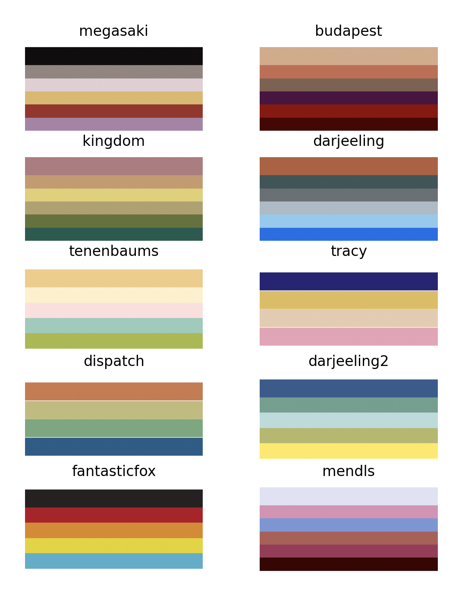

## wes-palette

wes-palette is a Wes Anderson film color palettes for matplotlib based on [vapeplot](https://github.com/dantaki/vapeplot)

## Installation
pip install wes-palette

## Examples

## Basic Usage

## Contributing

## License
