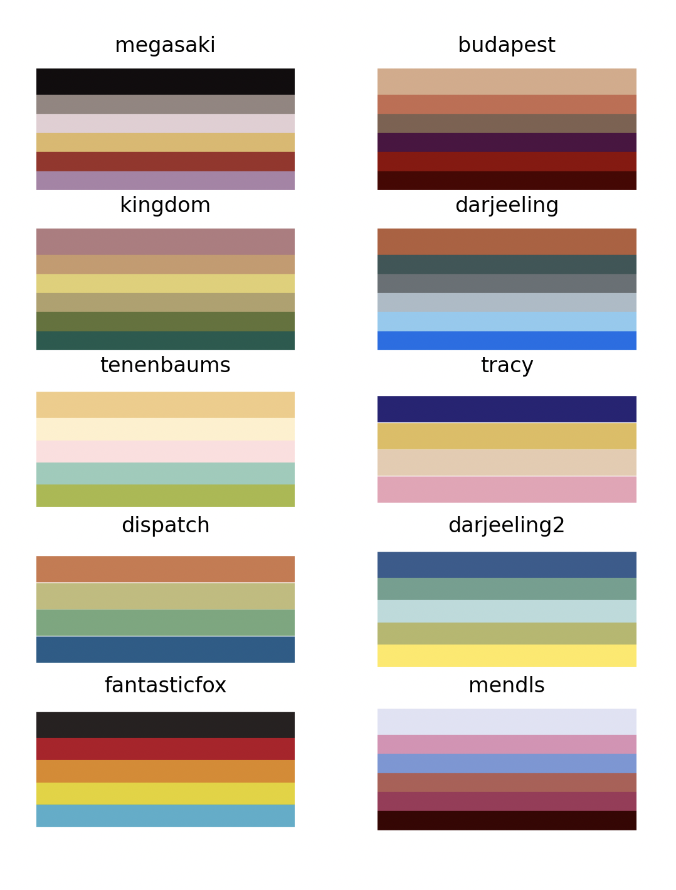
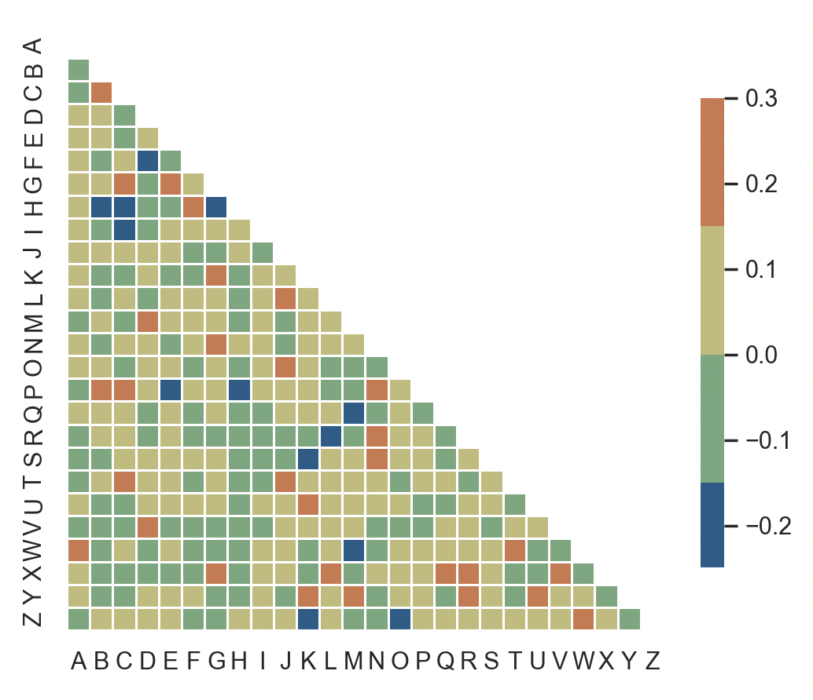
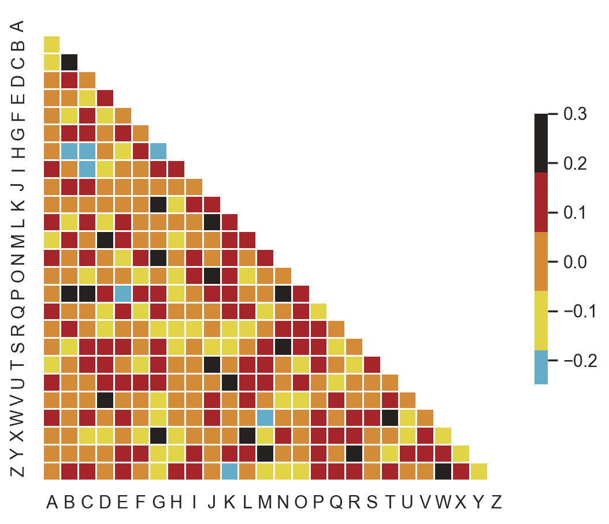
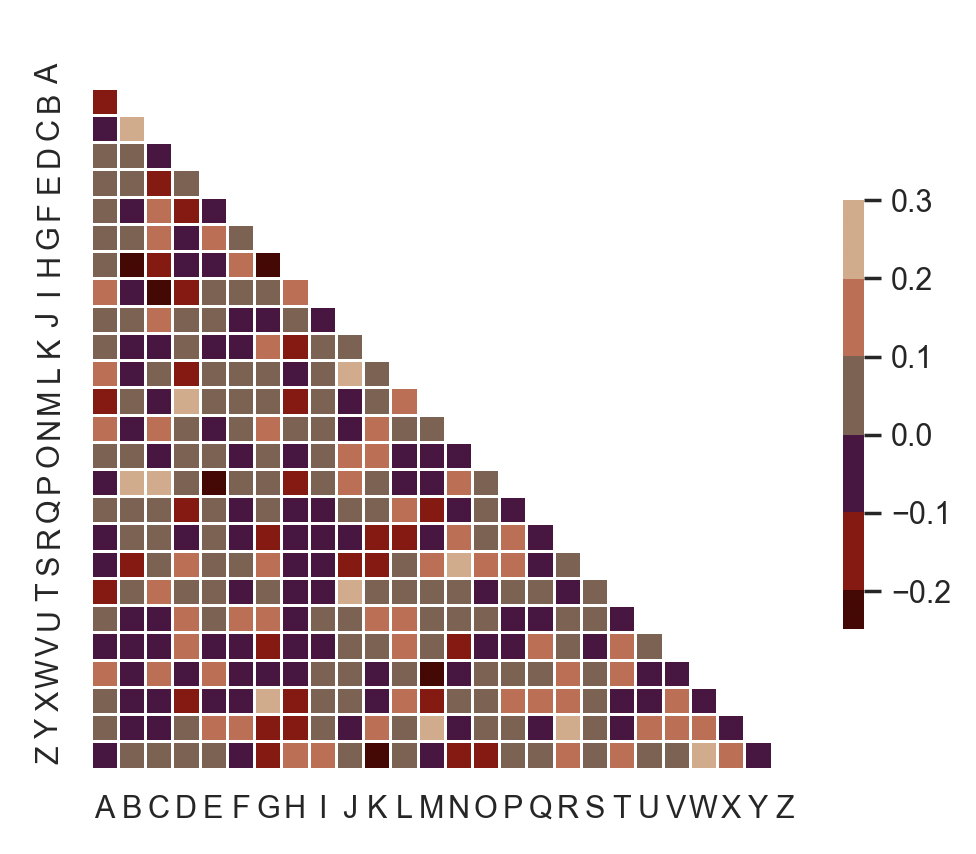

## Examples

## Basic Usage

Import the package
  
    import wes_palette as wes
    
Generate a custom diverging colormap

    cmap = wes.cmap('budapest')
    
Create your graph with matplotlib and then display the plot:
    
    plt.show()

## Example

    # Create a visualization
    sns.set_theme(style="white")

    # Generate a large random dataset
    rs = np.random.RandomState(33)
    d = pd.DataFrame(data=rs.normal(size=(100, 26)),
                 columns=list(ascii_letters[26:]))

    # Compute the correlation matrix
    corr = d.corr()

    # Generate a mask for the upper tria#ngle
    mask = np.triu(np.ones_like(corr, dtype=bool))

    # Set up the matplotlib figure
    f, ax = plt.subplots(figsize=(11, 9))

    # Generate a custom diverging colormap
    cmap = wes.cmap('dispatch')

    # Draw the heatmap with the mask and correct aspect ratio
    sns.heatmap(corr, mask=mask, cmap=cmap, vmax=.3, center=0,
            square=True, linewidths=.5, cbar_kws={"shrink": .5})

    plt.show()
    

